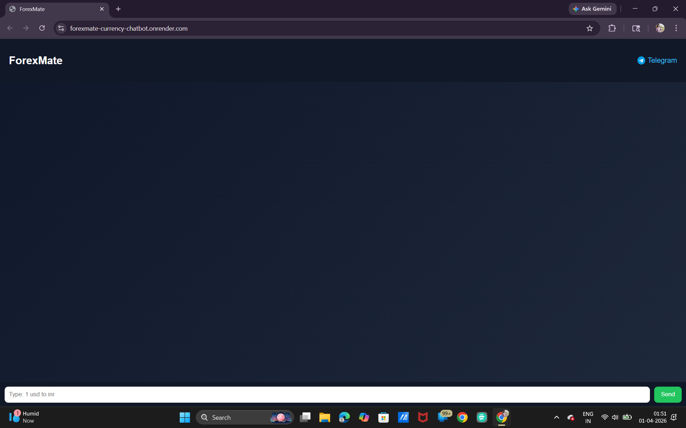
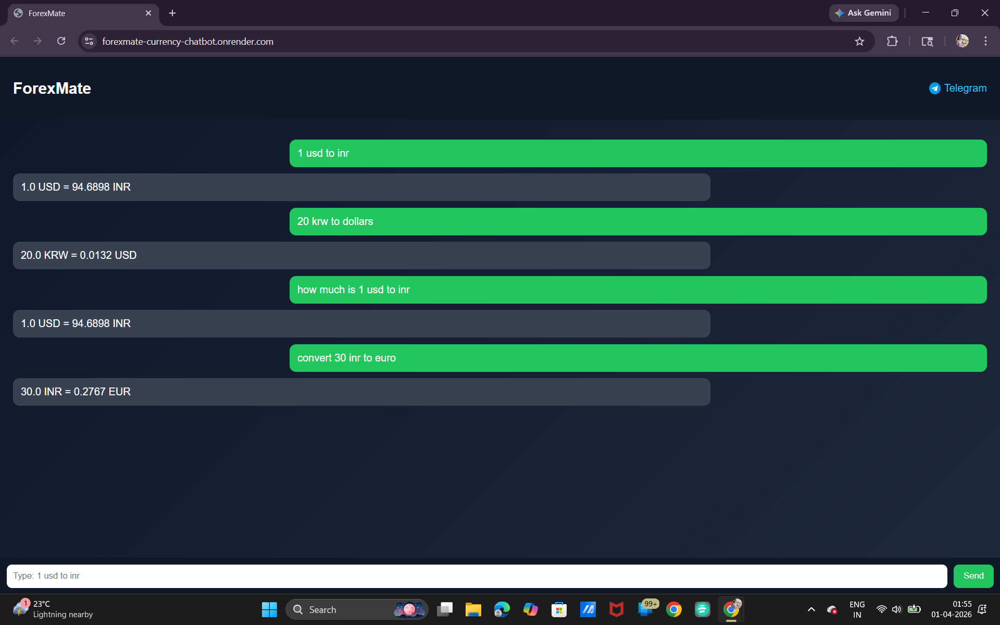
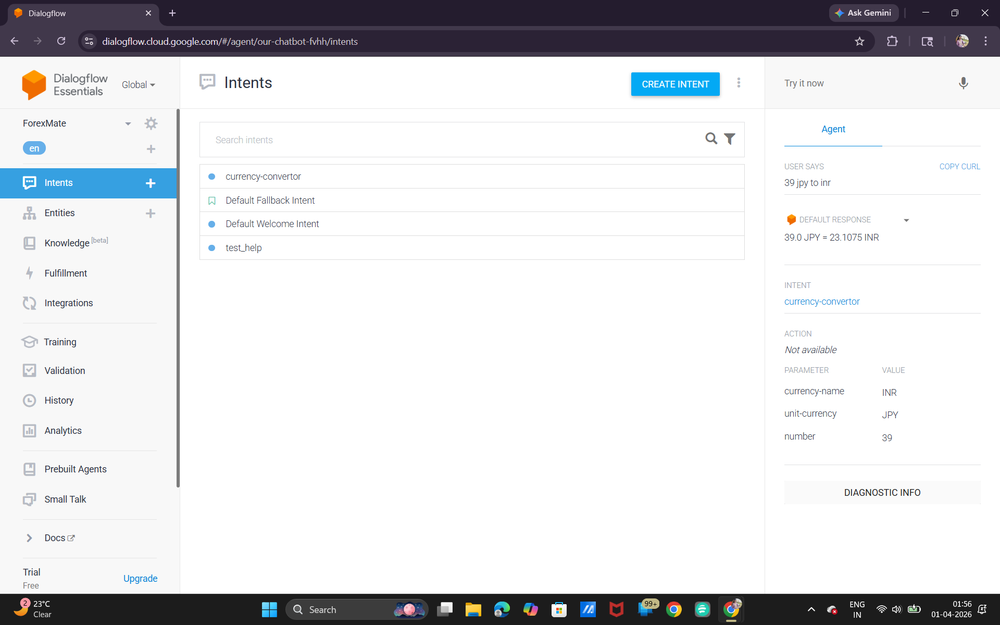
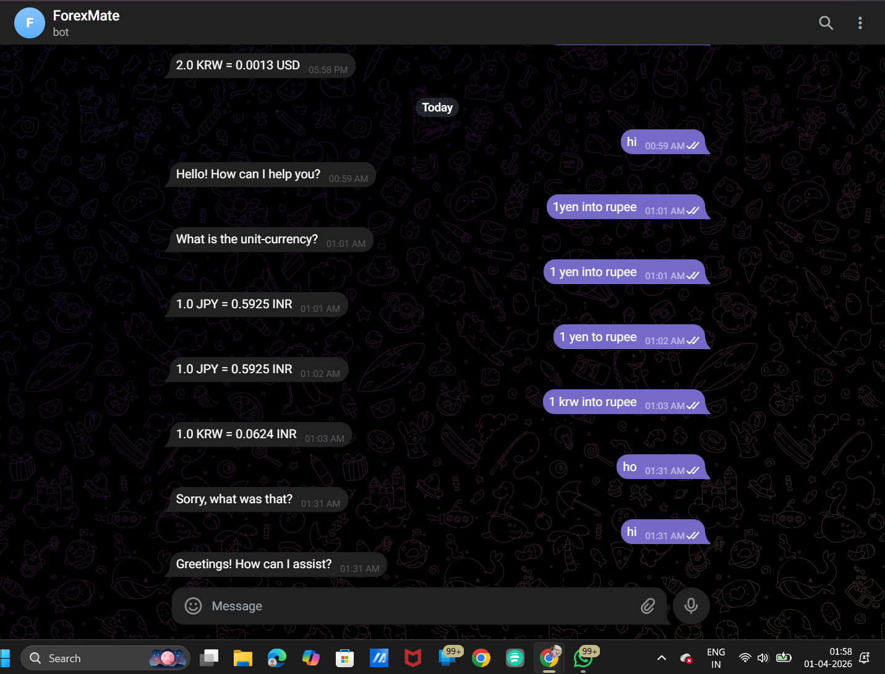

💱 AI Currency Converter Chatbot

An intelligent chatbot that provides real-time currency conversion using natural language queries. This project integrates APIs with NLP to deliver fast and accurate exchange rate responses.

Live Demo

Web Application: https://forexmate-currency-chatbot.onrender.com/
Telegram Bot: https://t.me/ForexMate_bot

---

🚀 Features

- 🌍 Real-time currency conversion
- 💬 Natural language query support (e.g., "Convert 100 USD to INR")
- 🤖 Dialogflow-based chatbot integration
- 📊 Fast API response handling
- 🌐 Web interface support
- 📱 Telegram chatbot support

---

🛠️ Tech Stack

- Python
- Flask
- Dialogflow (NLP)
- REST APIs (Exchange Rates)
- HTML / CSS

---

📂 Project Structure

app.py → Main backend logic
requirements.txt → Dependencies
templates → HTML files
screenshots → UI images

---

⚙️ How It Works

1. User enters a currency query
2. Dialogflow processes the intent
3. Flask backend handles API request
4. Real-time exchange rate is fetched
5. Response is displayed to user

---

📸 Screenshots

---

🔥 Key Highlights

- Built a real-time chatbot using NLP techniques
- Integrated third-party APIs for live data
- Designed scalable backend using Flask
- Supports multi-platform usage (Web + Telegram)

---

🎯 Future Improvements

- Add voice-based interaction 🎤

- Add currency trend graphs 📈
- Improve UI/UX

---

👩‍💻 Author

Sahana (CSE-AIML)
  

---

⭐ If you like this project, give it a star!
